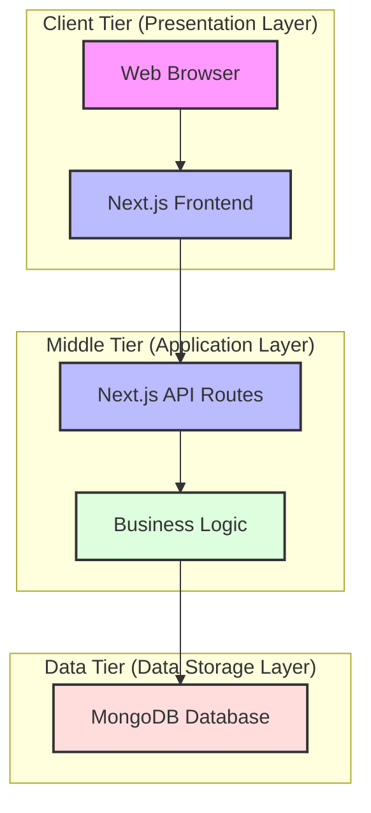
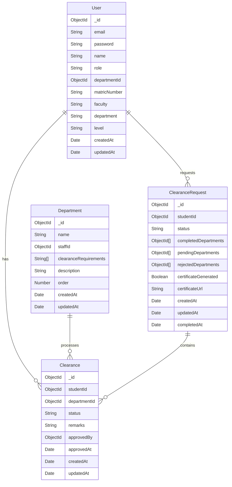
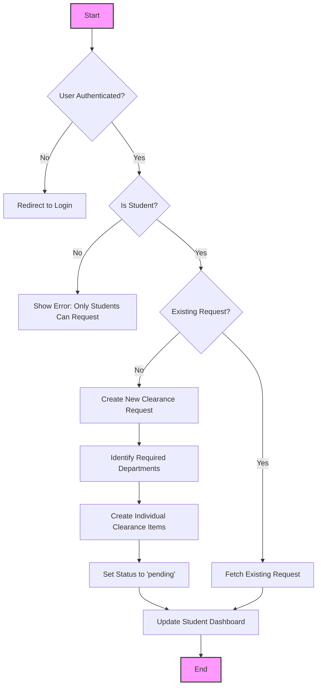
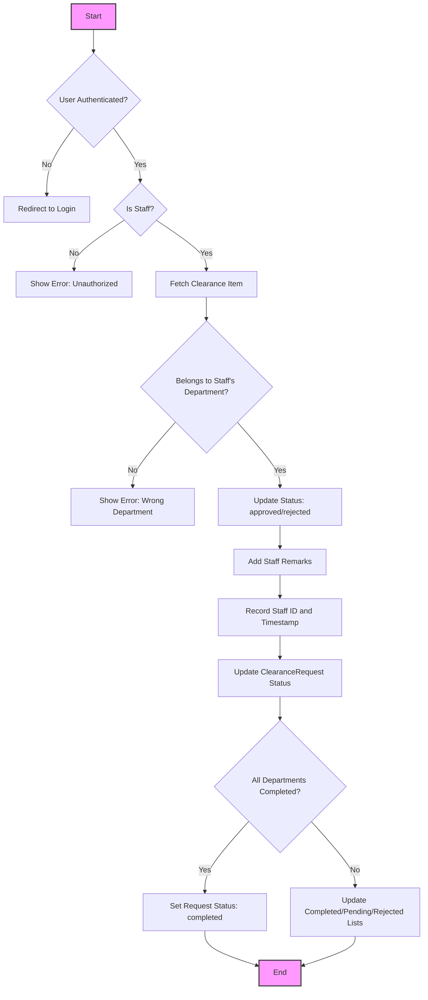
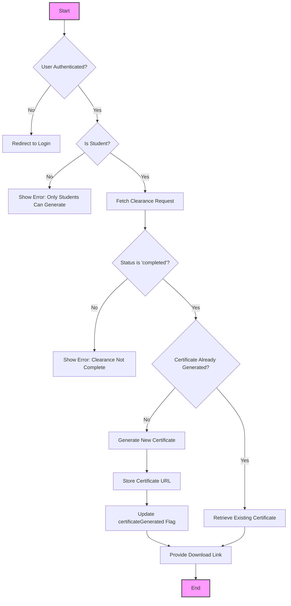
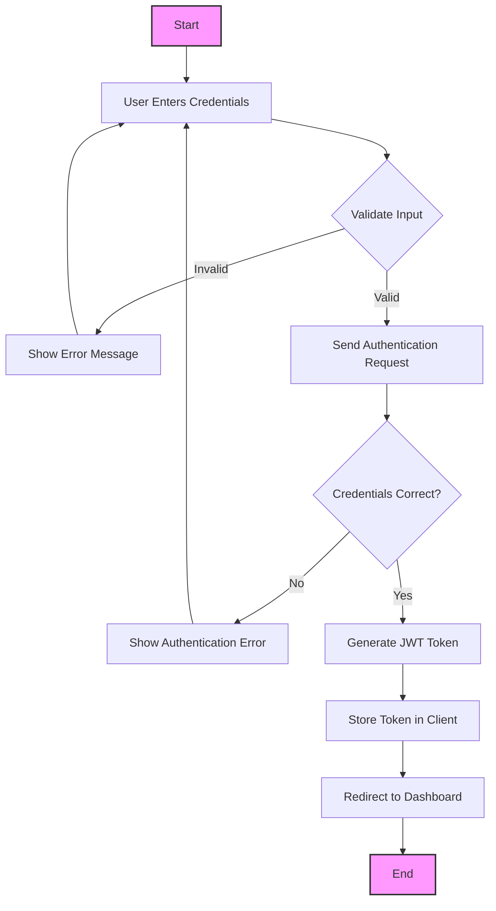
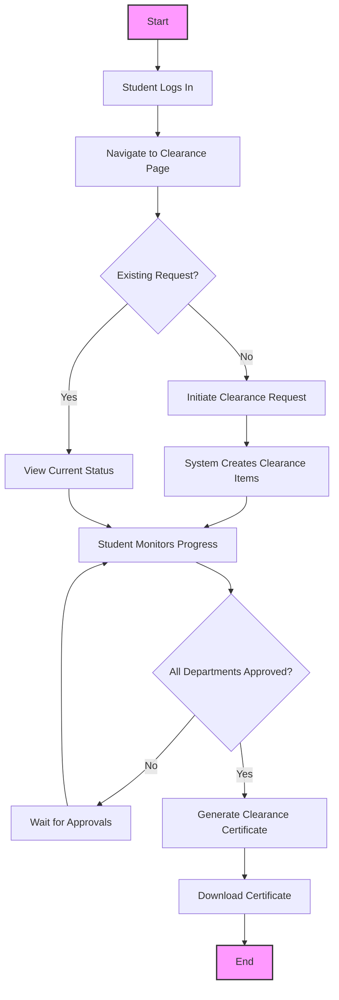
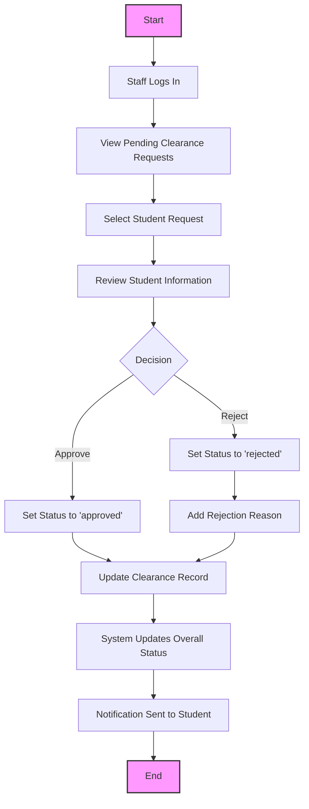

# CHAPTER FOUR: SYSTEM DESIGN AND IMPLEMENTATION

## 4.1 Objective of Design

The primary objective of designing the University Clearance System is to create a streamlined, efficient, and user-friendly platform that automates the clearance process for graduating students. The design aims to achieve the following specific objectives:

1. **Eliminate Manual Paperwork**: Replace traditional paper-based clearance forms with a digital system that reduces physical documentation and manual processing.

2. **Centralize Clearance Management**: Create a unified platform where students can track their clearance status across all university departments from a single dashboard.

3. **Improve Process Transparency**: Provide real-time visibility into the clearance process, allowing students to know exactly which departments have cleared them and which ones are pending.

4. **Enhance Administrative Efficiency**: Equip department staff with tools to quickly review and approve/reject clearance requests with appropriate remarks.

5. **Ensure Data Security**: Implement secure authentication and authorization mechanisms to protect sensitive student information.

6. **Facilitate Certificate Generation**: Automate the generation of clearance certificates upon successful completion of all departmental clearances.

7. **Create Scalable Architecture**: Design a system that can handle increasing numbers of students and departments without performance degradation.

## 4.2 System Architecture in Terms of Tiers

The University Clearance System is built on a modern three-tier architecture that separates the application into distinct layers, each with specific responsibilities. This architecture enhances maintainability, scalability, and security.

**Figure 4.1: Three-Tier Architecture of the University Clearance System**

### 4.2.1 Client Tier (Presentation Layer)
- Implemented using Next.js and React for rendering user interfaces
- Responsive design using Tailwind CSS for optimal viewing on different devices
- Client-side state management using React hooks and context API
- Interactive components for user engagement and feedback

### 4.2.2 Middle Tier (Application Layer)
- Next.js API routes for handling HTTP requests
- Business logic implementation for clearance processing
- Authentication and authorization middleware
- Data validation and error handling
- Integration with the database layer

### 4.2.3 Data Tier (Data Storage Layer)
- MongoDB database for persistent data storage
- Mongoose ODM (Object Data Modeling) for schema definition and validation
- Data models for Users, Departments, Clearance requests, and Clearance items
- Indexes for optimizing query performance

## 4.3 Choice of Programming Environment

The University Clearance System is developed using a modern JavaScript/TypeScript stack with the following technologies:

### 4.3.1 Frontend Technologies
- **Next.js (v14.2.27)**: A React framework that enables server-side rendering and static site generation for improved performance and SEO.
- **React (v18)**: A JavaScript library for building user interfaces with component-based architecture.
- **Tailwind CSS (v3.4.1)**: A utility-first CSS framework for rapidly building custom designs.
- **TypeScript (v5)**: A strongly typed programming language that builds on JavaScript, providing better tooling and error detection.

### 4.3.2 Backend Technologies
- **Next.js API Routes**: Serverless functions for handling API requests.
- **MongoDB (v8.18.2)**: A NoSQL document database for storing application data.
- **Mongoose**: An Object Data Modeling (ODM) library for MongoDB and Node.js.
- **bcrypt (v6.0.0)**: A library for hashing and comparing passwords securely.
- **jsonwebtoken (v9.0.2)**: For implementing JWT-based authentication.

### 4.3.3 Development Tools
- **npm/Node.js**: Package management and runtime environment.
- **ESLint**: For code linting and maintaining code quality.
- **dotenv (v17.2.2)**: For managing environment variables.
- **react-hot-toast (v2.6.0)**: For displaying toast notifications.

The choice of this programming environment offers several advantages:

1. **Full-Stack JavaScript**: Using JavaScript/TypeScript throughout the stack simplifies development and allows for code sharing between frontend and backend.

2. **Server-Side Rendering**: Next.js provides improved performance and SEO through server-side rendering.

3. **Scalability**: The serverless architecture of Next.js API routes allows the application to scale automatically based on demand.

4. **Developer Experience**: Modern tooling and libraries enhance developer productivity and code quality.

5. **Community Support**: All chosen technologies have large, active communities providing resources, updates, and support.

## 4.4 Database Structure

The system uses MongoDB, a NoSQL document database, which provides flexibility in schema design and scalability. The database structure is organized around collections that represent the core entities of the clearance system.

**Figure 4.2: Entity Relationship Diagram of the University Clearance System Database**

## 4.5 Database Table Definition

The database schema is defined using Mongoose, which provides structure and validation for the MongoDB collections. Below are the detailed definitions of each collection:

### 4.5.1 User Collection

The User collection stores information about all users of the system, including students, staff, and administrators.

| Field | Type | Description | Constraints |
|-------|------|-------------|-------------|
| _id | ObjectId | Unique identifier | Auto-generated |
| email | String | User's email address | Required, Unique, Valid email format |
| password | String | Hashed password | Required, Min length: 6 |
| name | String | User's full name | Required |
| role | String | User's role in the system | Enum: ['student', 'staff', 'admin'], Default: 'student' |
| departmentId | ObjectId | Department ID for staff | Required for staff |
| matricNumber | String | Student's matriculation number | Required for students, Unique |
| faculty | String | Student's faculty | Required for students |
| department | String | Student's department | Required for students |
| level | String | Student's level | Required for students, Enum: ['100', '200', '300', '400', '500', 'PG'] |
| createdAt | Date | Record creation timestamp | Default: current date |
| updatedAt | Date | Record update timestamp | Default: current date |

### 4.5.2 Department Collection

The Department collection stores information about university departments involved in the clearance process.

| Field | Type | Description | Constraints |
|-------|------|-------------|-------------|
| _id | ObjectId | Unique identifier | Auto-generated |
| name | String | Department name | Required, Unique |
| staffId | ObjectId | ID of staff managing the department | Reference to User collection |
| clearanceRequirements | Array of String | List of requirements for clearance | - |
| description | String | Department description | - |
| order | Number | Processing order in clearance workflow | Default: 0 |
| createdAt | Date | Record creation timestamp | Default: current date |
| updatedAt | Date | Record update timestamp | Default: current date |

### 4.5.3 ClearanceRequest Collection

The ClearanceRequest collection tracks the overall clearance status for each student.

| Field | Type | Description | Constraints |
|-------|------|-------------|-------------|
| _id | ObjectId | Unique identifier | Auto-generated |
| studentId | ObjectId | ID of student requesting clearance | Required, Unique, Reference to User collection |
| status | String | Overall status of clearance request | Enum: ['pending', 'in-progress', 'completed', 'rejected'], Default: 'pending' |
| completedDepartments | Array of ObjectId | Departments that have approved | Reference to Department collection |
| pendingDepartments | Array of ObjectId | Departments with pending approval | Reference to Department collection |
| rejectedDepartments | Array of ObjectId | Departments that have rejected | Reference to Department collection |
| certificateGenerated | Boolean | Whether certificate has been generated | Default: false |
| certificateUrl | String | URL to generated certificate | - |
| createdAt | Date | Record creation timestamp | Default: current date |
| updatedAt | Date | Record update timestamp | Default: current date |
| completedAt | Date | When clearance was completed | - |

### 4.5.4 Clearance Collection

The Clearance collection stores individual clearance items between a student and a specific department.

| Field | Type | Description | Constraints |
|-------|------|-------------|-------------|
| _id | ObjectId | Unique identifier | Auto-generated |
| studentId | ObjectId | Student ID | Required, Reference to User collection |
| departmentId | ObjectId | Department ID | Required, Reference to Department collection |
| status | String | Status of this specific clearance | Enum: ['pending', 'approved', 'rejected'], Default: 'pending' |
| remarks | String | Comments from department staff | - |
| approvedBy | ObjectId | Staff who processed the clearance | Reference to User collection |
| approvedAt | Date | When clearance was processed | - |
| createdAt | Date | Record creation timestamp | Default: current date |
| updatedAt | Date | Record update timestamp | Default: current date |

## 4.6 Input and Output Screen Format

The University Clearance System features a responsive user interface designed to provide an intuitive experience across different devices. Below are the key screens of the system:

### 4.6.1 Login Screen

The login screen provides authentication functionality for all users (students, staff, and administrators). It features:
- Email and password input fields
- Role selection
- Form validation
- Error messaging
- "Forgot Password" link
- Navigation to signup for new users

### 4.6.2 Student Dashboard

The student dashboard serves as the central hub for students to monitor their clearance progress:
- Summary cards showing overall clearance status
- Progress indicators for completed, pending, and rejected departments
- Action buttons for initiating clearance requests
- Certificate generation option (when eligible)

### 4.6.3 Clearance Status Screen

This screen provides detailed information about a student's clearance status:
- Tabular view of all departments with their clearance status
- Status indicators (pending, approved, rejected) with appropriate color coding
- Remarks from department staff
- Timestamps for each action

### 4.6.4 Staff Dashboard

The staff dashboard enables department personnel to manage clearance requests:
- List of pending clearance requests
- Search and filter functionality
- Quick approve/reject actions
- Comment/remarks input field
- Historical view of processed requests

### 4.6.5 Admin Dashboard

The admin dashboard provides system-wide management capabilities:
- User management (create, edit, disable accounts)
- Department configuration
- Clearance requirement setup
- System statistics and reports
- Audit logs

## 4.7 Program Algorithm

The core algorithms of the University Clearance System are designed to efficiently manage the clearance workflow. Below are the key algorithms implemented in the system:

### 4.7.1 Clearance Request Initiation Algorithm

**Figure 4.3: Clearance Request Initiation Algorithm**

### 4.7.2 Clearance Approval Algorithm

**Figure 4.4: Clearance Approval Algorithm**

### 4.7.3 Certificate Generation Algorithm

**Figure 4.5: Certificate Generation Algorithm**

## 4.8 Program Flowcharts

The following flowcharts illustrate the main processes in the University Clearance System:

### 4.8.1 User Authentication Flow

**Figure 4.6: User Authentication Flow**

### 4.8.2 Student Clearance Process Flow

**Figure 4.7: Student Clearance Process Flow**

### 4.8.3 Staff Approval Process Flow

**Figure 4.8: Staff Approval Process Flow**

## 4.9 Hardware Requirements

The University Clearance System is a web-based application that can run on standard hardware configurations. The following are the recommended hardware requirements:

### 4.9.1 Server Requirements
- **Processor**: Multi-core CPU (4+ cores recommended)
- **RAM**: 8GB minimum, 16GB recommended
- **Storage**: 50GB SSD minimum
- **Network**: High-speed internet connection with at least 100 Mbps bandwidth
- **Backup**: External storage or cloud backup solution

### 4.9.2 Client Requirements
- **Processor**: Any modern dual-core processor (2.0 GHz or higher)
- **RAM**: 4GB minimum
- **Storage**: 5GB available disk space
- **Display**: 1366 x 768 resolution or higher
- **Network**: Stable internet connection (minimum 1 Mbps)

### 4.9.3 Mobile Device Requirements
- **Operating System**: iOS 12+ or Android 8+
- **RAM**: 2GB minimum
- **Display**: 5-inch screen or larger recommended
- **Network**: 3G connection minimum, 4G/LTE or Wi-Fi recommended

## 4.10 Software Requirements

The following software components are required to develop, deploy, and use the University Clearance System:

### 4.10.1 Development Environment
- **Operating System**: Windows 10/11, macOS, or Linux
- **Runtime**: Node.js (v16.x or higher)
- **Package Manager**: npm (v7.x or higher) or Yarn (v1.22.x or higher)
- **Version Control**: Git
- **IDE**: Visual Studio Code, WebStorm, or any modern JavaScript IDE
- **Browser**: Chrome, Firefox, Safari, or Edge (latest versions)

### 4.10.2 Server Environment
- **Operating System**: Ubuntu 20.04 LTS or higher
- **Web Server**: Nginx (for production deployment)
- **Database**: MongoDB (v5.0 or higher)
- **Node.js**: v16.x or higher
- **Process Manager**: PM2 or similar

### 4.10.3 Client Environment
- **Web Browser**: Chrome (v90+), Firefox (v90+), Safari (v14+), or Edge (v90+)
- **JavaScript**: Enabled
- **Cookies**: Enabled
- **Local Storage**: Available and accessible

### 4.10.4 Dependencies
- **Frontend**: React, Next.js, Tailwind CSS
- **Backend**: Next.js API Routes, Mongoose
- **Authentication**: JWT, bcrypt
- **Notification**: react-hot-toast
- **Environment Management**: dotenv

## 4.11 Documentation

The University Clearance System includes comprehensive documentation to assist users, administrators, and developers:

### 4.11.1 User Documentation
- **Student Guide**: Instructions for requesting clearance, tracking status, and generating certificates
- **Staff Guide**: Procedures for reviewing and processing clearance requests
- **Admin Guide**: System configuration, user management, and reporting

### 4.11.2 Technical Documentation
- **System Architecture**: Detailed description of system components and their interactions
- **API Documentation**: Comprehensive documentation of all API endpoints
- **Database Schema**: Complete database structure and relationships
- **Deployment Guide**: Step-by-step instructions for deploying the system

### 4.11.3 Code Documentation
- **Inline Comments**: Explanatory comments within the codebase
- **README Files**: Overview and setup instructions
- **JSDoc**: Documentation for JavaScript functions and components
- **Change Log**: Record of system versions and changes

### 4.11.4 Maintenance Documentation
- **Troubleshooting Guide**: Common issues and their solutions
- **Backup and Recovery Procedures**: Instructions for data backup and restoration
- **Performance Optimization**: Guidelines for maintaining system performance
- **Security Protocols**: Security best practices and vulnerability management

# CHAPTER FIVE: SUMMARY, CONCLUSION AND RECOMMENDATION

## 5.1 Summary

The University Clearance System was developed to address the challenges associated with the traditional manual clearance process for graduating students. The existing paper-based system was characterized by numerous inefficiencies, including long queues, document loss, delayed processing, and lack of transparency. These issues often resulted in frustration for students and administrative staff alike, sometimes delaying graduation timelines.

This project aimed to develop a comprehensive web-based solution that automates and streamlines the entire clearance process. The system was built using modern web technologies including Next.js, React, MongoDB, and Tailwind CSS, creating a responsive and user-friendly application accessible on various devices.

The implemented system offers the following key features:

1. **Centralized Clearance Management**: Students can initiate and track their clearance process from a single dashboard, eliminating the need to physically visit multiple departments.

2. **Real-time Status Tracking**: The system provides immediate visibility into the approval status of each department, allowing students to know exactly where they stand in the clearance process.

3. **Digital Approval Workflow**: Department staff can efficiently review, approve, or reject clearance requests with appropriate remarks through an intuitive interface.

4. **Automated Certificate Generation**: Upon successful completion of all departmental clearances, the system automatically generates a clearance certificate for the student.

5. **Role-based Access Control**: Different user types (students, staff, administrators) have access to specific functionalities relevant to their roles.

6. **Secure Authentication**: The system implements JWT-based authentication with password hashing to ensure secure access to user accounts.

7. **Responsive Design**: The user interface adapts to different screen sizes, making it accessible on desktops, tablets, and mobile devices.

The development process followed a systematic approach, starting with requirements gathering, followed by system design, implementation, testing, and deployment. The system architecture was designed with scalability and maintainability in mind, using a three-tier structure that separates the presentation, application, and data layers.

## 5.2 Conclusion

The University Clearance System successfully transforms the traditional manual clearance process into a streamlined digital workflow. By leveraging modern web technologies and following best practices in software development, the system addresses the key challenges identified in the manual process.

The implementation of this system brings several significant benefits:

1. **Efficiency Improvement**: The digital workflow dramatically reduces the time required to complete the clearance process, from weeks to potentially days or even hours.

2. **Enhanced Transparency**: Students now have clear visibility into their clearance status and any requirements they need to fulfill for each department.

3. **Reduced Administrative Burden**: Department staff can process clearance requests more efficiently, reducing the workload associated with manual paperwork.

4. **Elimination of Physical Constraints**: Students no longer need to be physically present on campus to initiate or follow up on their clearance process, which is particularly beneficial for those who have completed their coursework and may have relocated.

5. **Improved Data Integrity**: The digital system ensures accurate record-keeping and eliminates issues related to lost or damaged paper documents.

6. **Environmental Impact**: By reducing paper usage, the system contributes to environmental sustainability efforts.

The successful implementation of this system demonstrates how digital transformation can significantly improve administrative processes in educational institutions. The modular and scalable architecture of the system allows for future enhancements and adaptations to meet evolving requirements.

In conclusion, the University Clearance System represents a significant step forward in modernizing university administrative processes, benefiting both students and staff while contributing to the institution's efficiency and digital transformation goals.

## 5.3 Recommendation

Based on the development and implementation experience of the University Clearance System, the following recommendations are proposed for future enhancements and broader adoption:

### 5.3.1 System Enhancements

1. **Mobile Application Development**: While the current web application is responsive, developing dedicated mobile applications for iOS and Android would further improve accessibility and user experience, especially for students who primarily use mobile devices.

2. **Integration with Other University Systems**: Integrate the clearance system with other university systems such as the student information system, financial management system, and library management system to automate data sharing and reduce redundant information entry.

3. **Advanced Analytics Dashboard**: Implement comprehensive analytics features to provide administrators with insights into clearance patterns, bottlenecks, and departmental performance.

4. **Document Upload Functionality**: Add the ability for students to upload required documents directly within the system, further reducing the need for physical document handling.

5. **Notification System Expansion**: Enhance the notification system to include email alerts, SMS notifications, and in-app reminders for pending actions and status updates.

6. **Blockchain Integration**: Consider implementing blockchain technology for certificate verification to prevent forgery and enhance the credibility of digital clearance certificates.

### 5.3.2 Implementation Strategy

1. **Phased Rollout**: Implement the system in phases, starting with a pilot in selected departments before full-scale deployment across the university.

2. **Comprehensive Training**: Develop detailed training materials and conduct sessions for all user types (students, staff, administrators) to ensure smooth adoption.

3. **Feedback Mechanism**: Establish a robust feedback system to continuously gather user input and identify areas for improvement.

4. **Performance Monitoring**: Implement monitoring tools to track system performance and user engagement, allowing for data-driven optimization.

5. **Regular Updates**: Maintain a schedule for system updates to incorporate new features, security patches, and technology upgrades.

### 5.3.3 Policy Recommendations

1. **Digital-First Policy**: Encourage the university to adopt a digital-first approach for administrative processes beyond clearance, using this system as a successful case study.

2. **Data Retention Policy**: Develop clear policies regarding data retention and archiving to ensure compliance with relevant regulations while maintaining system performance.

3. **Disaster Recovery Plan**: Establish comprehensive backup and recovery procedures to protect against data loss and ensure business continuity.

4. **Security Audits**: Conduct regular security audits and penetration testing to identify and address potential vulnerabilities.

5. **User Support Structure**: Create a dedicated support team or help desk to assist users with system-related issues and questions.

### 5.3.4 Research Opportunities

1. **User Experience Studies**: Conduct research on user experience to identify patterns and preferences that could inform future system enhancements.

2. **Process Optimization Analysis**: Analyze the digital clearance workflow to identify further optimization opportunities and best practices.

3. **Comparative Analysis**: Compare the efficiency and effectiveness of the digital system against the previous manual process to quantify improvements and ROI.

4. **Technology Adoption Research**: Study the factors affecting technology adoption among different user groups to inform future digital transformation initiatives.

By implementing these recommendations, the University Clearance System can continue to evolve, providing even greater value to the institution and its stakeholders while serving as a model for digital transformation in higher education administrative processes.
